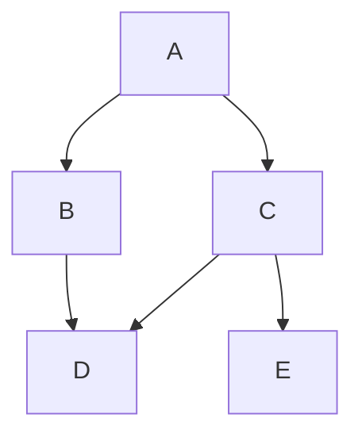
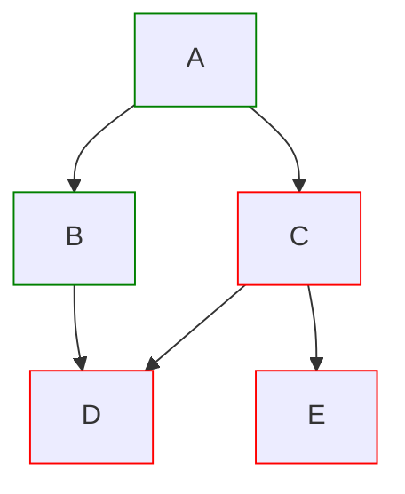
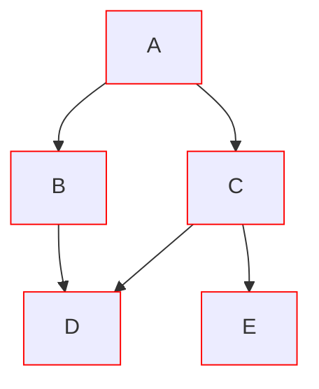
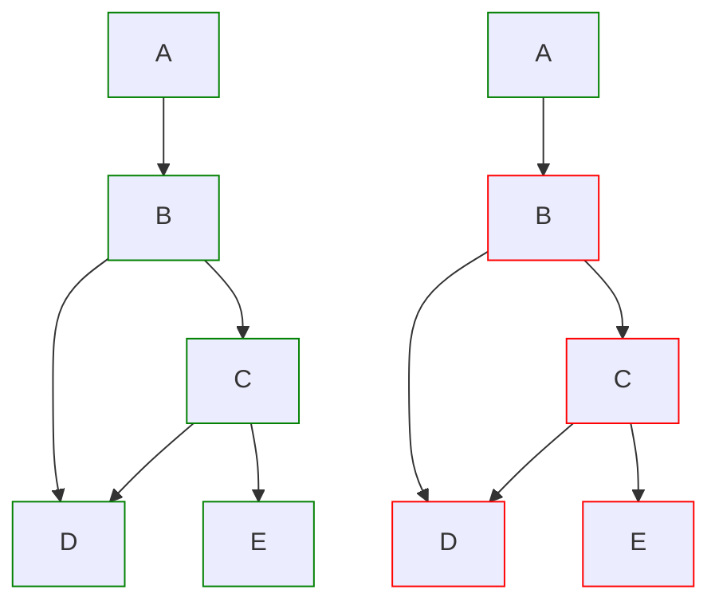

# Clockuments: Validation-based strategy

In the previous model, we relied on 2PC to ensure that, on a well-behaved storage, document dependencies were never invalid.

However, it has quickly become clear that this is pretty fundamentally at-odds with Subduction's replication-based sync strategy -- we can't simply `put` data into a peer, in a way that is reliable and won't mess up *other* peers.

Instead, let's solve the hard problem: Given an arbitrary set of both valid and invalid data on a server, ensure we only operate on the valid data when we make commits locally.

## Finding Ready Heads

An Automerge document takes the shape of a directed-acyclic graph (DAG). Take a document `root`:

At any point, the leaf nodes of this graph represent the *latest heads*, in this case `[D, E]`.

> **Latest heads**: The set of leaf nodes of the entire Automerge document.

The problem we're trying to solve, here, is that if this document has linked dependencies, we must be able to transact only at heads that have those dependencies available. 

Define a function `ready(H)`, where `H` is a set of heads `[A, B...]` on the local document. This function returns whether every dependency of head `H` is available locally (including deeply-nested dependencies). Dependencies are expressed as document links, `document @ X`, where `X` is a set of *pinned heads* on `document`.

> **Document link**: A document ID associated with heads `X`, pinning the heads of `document` to `X`. 

A useful property of `ready(H)`: `ready([A, B, ..]) == ready([A]) && ready([B]) && ..`

The problem becomes, how do we find the most up-to-date heads `H`, where `ready(H)` is true? Those will be our *observed heads.*

> **Observed heads**: The deepest-possible, largest-possible set of heads `H` where `ready(H)` is true.

For example:

In this case, the **latest heads** are `[D, E]`, but the **observed heads** are `[B]`.

Note that if `ready(A)` were false, the **observed heads** would still be `[B]`, because we're looking for the deepest-possible solution, and `A` is not a leaf node after recursively removing all unready leaves.

Starting with a frontier of all leaf nodes, `observed_heads(doc)` can be found in `O(X + Y)` calls to `ready(H)` for some `H`, where `X` is the number of total unready leaves, and `Y` is the final length of `observed_heads`. If the tree is sparse, without many leaves, this is cheap. If not, it can get very expensive.

## Syncing & Transacting

At any given point, we are only allowed to `transact_at(H)` when `ready(H)` is true. Therefore, it is imperative that we keep track of which heads are `ready`.

For now, assume that sync is *greedy*: Whenever a clockument is synced, or whenever a dependency is synced, it is immediately replicated as fast as possible over the peer network. Larger documents will naturally take longer.

### New Peers

When a new peer Jadzia joins for the first time, she observes the clockument. Because dependencies are still syncing, she sees the clockument as:

She sees the **observed heads** as `[]`, representing the origin state of the document. If she made commits at this state, she would create useless data.

Instead, Jadzia needs to wait for a reasonable set of observed heads to be ready. She must obtain that set of observed heads from *someone else*, usually a sync server.

The server might have the following state: 

In this case, heads `C` and `E` are either waiting for their dependencies to upload to the server, or they are broken -- there's no way for Jadzia to know. However, Jadzia can check which documents are *downloading* from the server to get an idea of the incoming dependencies.

Define a function `almost_ready(H)`, where `H` is a set of heads `[A, B...]` on the local document. This function returns whether every dependency of head `H` is available locally OR is currently downloading (including deeply-nested dependencies).

TODO: Does Subduction tell us what *heads* are currently downloading? This is a huge problem for this idea!!!!!!!!

Jadzia can then use `almost_ready` to observe a set of **almost observable heads** incoming from the server. Then, she can wait for those heads to become locally observable -- i.e. have all their dependencies synced.

Once that is the case, Jadzia can *pin* the observable heads, and begin committing locally as an *existing peer*.

### Existing Peers & Heads-Pinning

For clients who already have data downloaded or created, and a set of observable heads `H` retrieved, they can *pin* those heads `H` by saving them as a file to disk, alongside their local document storage. That way, when relaunching the application, user Jadzia can immediately know that these heads are observable, and begin transacting to them without connecting to any peer at all!

When Jadzia *does* connect to a peer (like a sync server), she checks her document, and finds every unready head, that is not a parent of her pinned observable heads. For each head, she caches `wants(H)`, which returns the set of dependencies required before `ready(H)` is true.

Then, when new local dependencies are added, she removes them from each relevant head's wantlist. When the wantlist is empty, the head can be added to her **observed heads** (potentially superseding a previous head, if necessary), and pinned! The new heads are now ready for commits.

### Transacting

Once any heads are observed and pinned, those heads can be transacted to arbitrarily. Once those transactions are made, the resulting document can be synced greedily, and the resulting head can also be pinned. 

If dependencies are added, they must be stored, tracked, and synced as well.

## Normal Edge Cases

We now have a strategy for how existing peers can track and pin the observed clockument heads, fast-forward from incoming heads, and commit to them. Additionally, we have a mechanism for new peers to observe the *server's* observed heads, and catch-up to its state without transacting at any invalid heads in the meantime.

However, edge cases can occur during normal operation.

### Torn Storage

During a transaction, if a root clockument is saved to local storage and its heads are pinned before all its dependencies are saved, we run the risk of *torn storage*. If the client crashes in the middle of the commit, our pinned, observed heads might not be *actually* ready.

This can be easily solved by: 
1. Only pinning the observed heads once we've confirmed all dependencies are saved, OR
2. Saving the dependencies *first,* and only *then* saving, pinning, and syncing the root clockument (similar to a two-phase commit, just without rollback). 

Prefer the latter option to avoid a *torn sync*, when the new heads reach the server without the dependencies being present.

> **Solution**: Delayed Storage of Root
> Always store new or updated root dependencies, before storing the root clockument. Then, pin the new heads.

(If the client is closed before the heads can be pinned, then those heads are still valid, and will be fast-forwarded to as if they were incoming heads upon the next launch.)
### Torn Sync 

Similar to *torn storage*, if a head from a root clockument is uploaded to the server before the dependencies are uploaded, and the client is closed, we encounter a *torn sync*. In this case, we create an extraneous head on the server that might ***never*** be ready!

You might ask: Why is this a problem, if we always ensure the observed heads are ready before allowing transactions? 

Each torn sync creates a new, invalid head `[A, B...]` that might never be ready. Over the lifetime of the document, those broken heads can only increase. (See "Monotonically-Increasing Heads" for why this is a problem.)

As a result, we want to do a best-effort approach to avoid torn syncs. Similarly to torn storage, the solution is simple:

> **Solution**: Delayed Sync of Root
> Always sync all dependencies to a given peer before the root clockument is synced to that peer.

However, for the `sync` operation, we can't selectively sync only *some* heads. Because the root clockument may have heads from other peers, or from additional transactions, this "delay" strategy does not prevent every possible torn sync.

As a simple case, take two transactions made in quick succession, creating heads A and B. Both add a large dependency, `A1` and `B1`. Once `A1` is synced, we call `sync(root)`, and `B` is synced as well as `A`. However, `B1` has not uploaded yet. If the client closes, a torn commit is created.

We cannot simply replace our `delay(A)` for a `delay(B)`. If we do, we risk perpetually deadlocking our sync!

TODO: Maybe it's OK to deadlock previous heads? I think it probably maybe perhaps might be... (Even if we did though, it wouldn't 100% fix tearing.) 
### Monotonically-Increasing Heads

Even with our best strategy to avoid torn syncs, they still may occur with some frequency.

Remember that to find the observed heads, a user must call `ready(H)` `O(X + Y)` times, where `X` is the number of unready heads without a ready parent, and `Y` is the number of the resulting observed heads.

For torn syncs, the torn head `H` can never be transacted to. Therefore, it is never merged in with other leaf nodes. As such, the document gets leafier and leafier over time, and finding our observed heads gets slower and slower!

Additionally, for each unready head, each client must build a *wantlist* for that head, as it waits for dependencies to arrive. For heads resulting from a torn sync, or any other invalid head, that wantlist will never be fulfilled.

As such, we need a strategy to *ignore* some heads, when they become too frequent. We can model this as a cache that supports `N` heads -- say, we can track `N = 100` heads without a significant performance impact. 

After that, we will need to evict heads from the cache, according to a reasonable eviction policy.

> **Solution:** Time-Based Head Cache
> Only track the last `N` heads. If there are more than `N` heads, evict the oldest-heads first.

Essentially, we assume that if a head is very old, it probably won't get its dependency requirements met. 

But what if they *are* met? Let's say user Nerys created a torn commit, at head `A`. She logs off, for several months. In the meantime, Jadzia evicts head `A` from her cache, and stops looking for dependencies.

Then, Nerys logs back on, and resumes syncing the dependencies of head `A`. Because Jadzia is no longer tracking `A`, she's unaware that she should merge the now-ready `A` into her branch! Nerys is confused as to why her changes seemingly aren't replicating to her peers. (In fact, her changes are arriving -- they just are not being checked-out, because `A` is too old).

> **Solution**: Nudge-Based Head Cache
> Only track the last `N` heads. If there are more than `N` heads, evict the last-nudged heads first.
> *Nudge*: A nudge occurs when either a head is created, or a special message is broadcasted from a user saying that a dependency of that head has just been uploaded for the first time. 

Nudging is tricky and requires custom messaging. As such, I am not implementing it here. Instead, someone rejoining after their head has been evicted should simply make some changes, and then they should catch up. 

### Historical Dependencies 

In the above code, we only ever check the dependencies of the *leaf nodes*: parent heads are *never* checked to see whether they are ready. As such, we can't roll-back past a certain point, because old dependencies might not be synced through the network anymore!

This can cause additional tearing, or similar issues. 

As a result, if safety is desired at the cost of storage space and sync performance, the user of a clockument system must define their dependency function to never remove dependencies.

> **Solution**: Monotonically-Increasing Dependencies
> If a dependency `doc @ heads` is linked at head `H~1`, that same dependency, or a direct `doc @ heads+X` descendant, must also be linked at `H`.  

This solution can be implemented by storing dependencies as a monotonically-increasing set in the document itself. 
## Abnormal Edge Cases

Previously, we have been assuming that all peers are *well-behaved:* dependencies, once persisted to a given location, tend to *stay* in that location. Unfortunately, computers are often beset by software errors, cosmic rays, or trickster gods. 

### Negligent Local Data

If we have pinned our observed heads at H, but `ready(H)` is false, it means we have lost some local data since our previous launch.

To solve this issue, we basically have two options: 

 > **Solution:** Repair.
 > Assume the relevant dependencies have disappeared, and mark any heads `H` that rely on them as `ready(H)`. During future transactions, either rollback, recreate, or remove them in a future commit. 
 
> **Solution:** Revert.
> Find the actually-observed heads, and abandon the current pinned heads. If the missing dependency becomes available in the future from some peer, we can re-fast-forward to the heads we abandoned.

In the case of bad local data, we **immediately know** there is lost data, so assuming the dependency has disappeared is a reasonable answer. As such, we should probably choose *Repair*.
### Negligent Remote Data

On a server, imagine that a long-lived dependency gets dropped completely, invalidating an entire network of heads. Here, assume `B` and all children rely on dependency `B1`, which is then lost:

For existing peers, they should already have `B1`, and therefore able to easily restore it to the server on the next sync. No problems here!

But what if a *new* peer joins, without any backup from existing peers? 

Because a new peer must rely on the **observed heads** from the server before they can sync, the peer takes the server's observed heads to be `A`.

> **Solution:** Observe.
> Simply take the observed heads from the server, and pin them as usual.

That's a huge problem, because of a couple reasons: 

* The observed heads `A` could be weeks, months, or *years* old. If dependency `B1` is restored, the new peer's changes will be wildly different to the current state, leading to a bad merge.
* Because `A` could have hundreds, thousands, or millions of child heads, it could be actually impossible to find the observed head `A` in a reasonable amount of calls to `almost_ready(H)`! If we have a head cache as described in Monotonically-Increasing Dependencies, we might very quickly hit the limit of our cache.
* If *all* dependencies disappear, it's possible that the observed heads could be `[]` (an empty project)!

Any of these cases could cause significant data loss or user confusion.

Of course, there is a clear solution -- we do the same as the local case:

 > **Solution:** Repair.
 > Assume the dependency has disappeared, and either rollback, recreate, or remove it in a future commit. 

However, this is not so simple, for two reasons:

1. It is impossible, on the surface, to disambiguate a *negligent head* (i.e. a previously-valid dependency has disappeared, which we should repair) from a *torn head* (i.e. a bad sync that we should ignore) from an *in-progress head* (i.e. a head we will eventually check-out, but whose dependencies are still working through the system).
2. Similarly, even if we DID know that some dependencies have disappeared from the peer, we can't know *which* dependencies those are, and repair those specific heads without them. If we assumed *all* heads should be repaired, we suddenly merge in *every bad torn sync* that has ever occurred on the document (or, in the cache case, up to the cache size `N`). In this case, the latest heads become equivalent to the observed heads.

TODO: I have yet to think of a reasonable solution for this case, of a missing remote dependency and a newly joining peer. My best guess is:

> **Partial Solution:** Choose to *Repair* or *Observe* based on a heuristic. 
> Heuristic:
> - If we cannot find any observed heads on the remote with a reasonable cache size, *Repair*.
> - If we can find observed heads, but they are `X` hours/days/(number of commits) older than the latest unready leaf, *Repair.*
>     - This doesn't work in the case of a newly-torn sync on an old project... sigh. 
> - Otherwise, pin the found almost_observed heads, as usual (*Observe*).

## Rust API Design

TODO